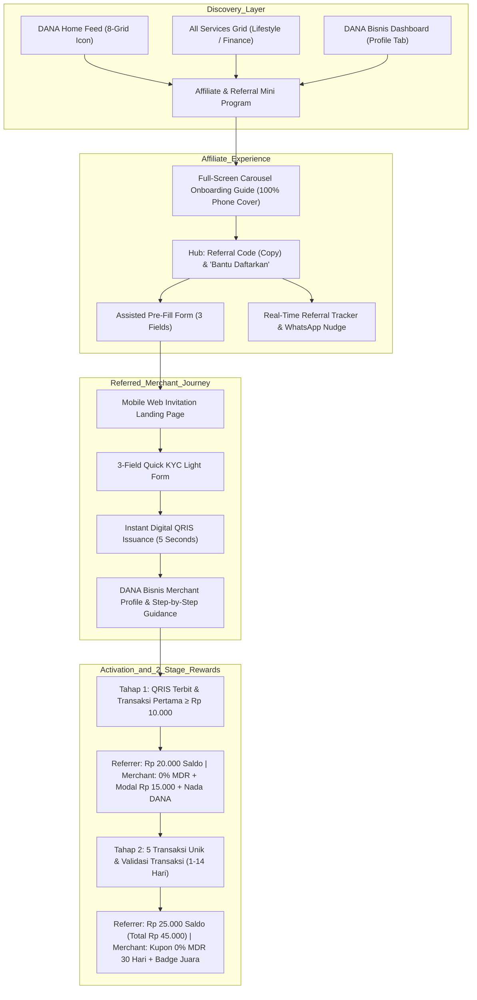
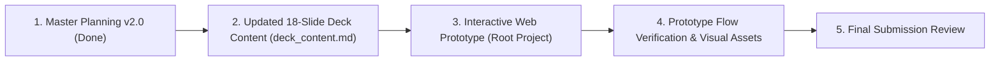

# DANA Bisnis Merchant Referral Program — Master Planning & Product Specification (v2.0)

> **Role & Submission Context**: DANA Take-Home Challenge — **Product Developer Intern**  
> **Topic**: Evolving the Existing "Affiliate DANA Bisnis" into an Adaptive Grassroots Referral Engine  
> **Target Reviewer**: Fritz Nathaniel (`fritz.nathaniel@dana.id`) & Product / Design Review Panel at DANA Indonesia  
> **Candidate**: Hafizh Najwan (`hafizhnjwn`)  
> **Date**: September 2026  
> **Deliverables**: 
> 1. Comprehensive Master Planning & Strategy Specification (`planning.md`)
> 2. 18-Slide Presentation Deck Blueprint in Polished English (`deck_content.md`)
> 3. Interactive Web-Based Clickable Prototype with Smartphone Simulator (Root project `index.html`)

---

## 1. Forensic Audit & Deep Research of Existing DANA Features

Based on a forensic audit of the 18 production screenshots from the current DANA iOS/Android app (`context/` directory) and official DANA documentation (`dana.id`), here is the comprehensive analysis of DANA's existing features, constraints, onboarding requirements, reward structures, and referencing mechanics:

### 1.1 Existing Feature Overview: "Affiliate DANA Bisnis" & "DANA Bisnis"
* **Discovery & Placement in DANA App**:
  - **Home Screen**: Directly accessible via the primary 8-icon shortcut grid as **"Affiliate DAN..."** (`IMG_8049.PNG`).
  - **"All Services" (Lihat Semua)**:
    - Categorized under **"Lifestyle & Deals"** as **"Affiliate DANA Bisnis"** with a dual-silhouette icon (`IMG_8055.PNG`). Located alongside companion merchant tools like *"Edit Foto Jualan"* (AI product photo enhancer).
    - Also discoverable under **"Finance"** as **"DANA Bisnis"** with a store awning and "Rp" emblem (`IMG_8054.PNG`).
  - **User Profile ("Saya")**: Features a top dual-toggle switch allowing users to switch between **"Personal"** and **"Bisnis"** modes (`IMG_8058.PNG`, `IMG_8068.PNG`).
* **Technical Runtime & Architecture**:
  - Built as a **DANA Mini Program** powered by the Ant Financial / Alipay Mini Program container (evidenced by the native title bar with `...` options and `(X)` close buttons, `IMG_8061.PNG`).
* **Navigation Architecture (4 Bottom Tabs)**:
  1. `Beranda` (Home Dashboard): Referral code box, 4-step commission guide, creator earning banners, affiliate guides, recent commissions, and milestone rewards (`IMG_8061.PNG`, `IMG_8062.PNG`).
  2. `Referal` (Referral List): Dedicated search bar and status tabs (`Semua` | `Belum Aktif`) with merchant list (`IMG_8063.PNG`).
  3. `Peringkat` (Leaderboard & Inspiration): Subtabs for `Papan Peringkat` (Top 20 affiliates ranked by 7/30 days) and `Inspirasi Konten` (video tutorials by top creators, `IMG_8064.PNG`, `IMG_8065.PNG`).
  4. `Inbox` (Notification Center): Broadcasts commission disbursement updates and system notices.

### 1.2 Existing Reward & Incentive Rules ("Ketentuan Komisi")
Audited directly from the production legal terms popup (`IMG_8066.PNG`):
* **Base Commission ("Komisi Utama")**: **Rp45.000** per active merchant.
* **Current Active Merchant Criteria ("Kriteria Usaha Aktif")**:
  - **Requirement 1**: Minimum of **5 QRIS transactions** completed.
  - **Requirement 2**: Passes transaction validity audit by the DANA Risk & Compliance Team.
  - **Operational Constraint**: **Verification takes 1 to 14 business days** (*"Pengecekan memerlukan waktu 1 hingga 14 hari"*).
* **Disbursement Timeline**: Commission is automatically credited into the referrer's DANA balance maximum **48 hours** after the active criteria is validated.
* **Commission Variation**: Commission per affiliate can vary based on the affiliate's transaction activity and the activity of the registered merchant.
* **Volume Milestone Bonus ("Hadiah Pencapaian")**:
  - Bonus **Rp1.000.000** for every **50 active merchants** using their QRIS (`IMG_8062.PNG`).
* **Target Audience Bias (Content Creator Orientation)**:
  - The existing UI heavily targets digital influencers and video creators. It showcases banners like *"Ada Affiliate yang sudah dapat Rp90 juta, lho!"* and displays a leaderboard where top affiliates (e.g. `MIC***`, `LIA***`, `FRI***`) have registered 800–900 active merchants earning Rp36M–Rp40M (`IMG_8064.PNG`).
  - It features an *"Inspirasi Konten"* tab with video guides by creators like `@andri.irv`, `@sudutbgrbarat`, and `@mitra.dana.bisnis` (`IMG_8065.PNG`).

### 1.3 Existing Merchant Registration & Onboarding ("Cara Daftar DANA Bisnis")
Audited from the in-app onboarding guide (`IMG_8068.PNG`, `IMG_8069.PNG`):
* **Strict Prerequisites & Steps**:
  - **Step 1**: Open the "Saya" (Profile) tab in DANA.
  - **Step 2**: **Mandatory DANA Premium Account**: User must be verified with an e-KTP photo and biometric facial recognition (`IMG_8068.PNG`).
  - **Step 3**: Toggle top switch from "Personal" to "Bisnis".
  - **Step 4**: Complete business profile:
    - *Profil Usaha*: Store name, business category.
    - *Lokasi Usaha*: Address details (RT/RW, subdistrict, store photo).
    - *Kode Referral*: **User must manually type in the affiliate's referral code**.
  - **Step 5**: Wait for backend verification: *"Memverifikasi datamu... Kami akan mengabarimu setelah prosesnya selesai. Ditunggu ya!"* (`IMG_8069.PNG`).
* **Merchant Value Proposition ("Kelebihan QRIS DANA Bisnis", `IMG_8067.PNG`)**:
  - *QRIS Bebas Potongan*: MDR 0% for micro-merchants (all sales revenue retained 100%).
  - *Saldo Langsung Cair*: Instant bank withdrawal with zero admin fees (no next-day T+1 delay).
  - *Suara di Tiap Transaksi*: Free audio announcement on every incoming payment (*"Nada DANA menyebutkan nominal tiap transaksi masuk"* / soundbox effect).
  - *Percantik Foto Produk*: AI-driven photo enhancer for menus, logos, and promotional posters.
  - *Rekan DANA*: Ability to become a neighborhood cash top-up agent.

---

## 2. Core Friction Points in Existing DANA & Strategic Breakthroughs (v2.0)

While the existing "Affiliate DANA Bisnis" is a strong program for online influencers, it faces severe structural barriers when applied to **organic, offline community referrals** (everyday consumers referring their neighborhood warung, or warung owners referring adjacent merchants):

| Operational Friction in Existing DANA | Root Cause in Production | Strategic Breakthrough in v2.2 |
| :--- | :--- | :--- |
| **1. The Cognitive Registration Wall** | Hesitant warung owners must upgrade to DANA Premium (KTP selfie), toggle to Bisnis, fill extensive forms, and **manually type the referral code**. | **"Bantu Daftarkan" (Assisted Pre-Registration) + KYC Light**: Referrer pre-fills 3 fields (Nama, Kategori, WhatsApp). Merchant verifies in 30s without KTP at start. QRIS issues in <5s. |
| **2. The 5-Transaction "Cliff" & 14-Day Delay** | Referrers get **Rp 0** unless the warung hits 5 txs AND waits 1–14 days for audit. Stopping at 2 txs yields zero, causing massive drop-off. | **2-Stage Gated Reward Structure (Total Rp45.000)**: • **Tahap 1**: Pendaftaran beres s/d QRIS terbit & transaksi pertama ≥ Rp10.000 = **Rp20.000 Saldo DANA**. • **Tahap 2**: 5 transaksi unik & audit validitas DANA (1–14 hari) = **Rp25.000 Saldo DANA**. |
| **3. Complex Manual Claim Friction** | Users often miss rewards hidden behind separate claim centers or expiring vouchers. | **Zero-Friction Auto-Credit**: No manual "Pusat Hadiah" claim button. Funds deposit automatically into DANA balance with high-visibility push & inbox notifications. |
| **4. Lack of Guidance for Referred Merchants** | Once registered, micro-merchants often don't know what to do next, leading to dormant QRIS. | **Full-Screen Carousel Guide & Profil Bisnis Checklist**: Immersive full-screen carousel before entering affiliate hub, plus 5-step operational guidance inside merchant's profile. |
| **5. Referral Code Confusion** | Multiple redundant sharing buttons (green WA button, QR invitation) clutter the interface. | **Clean 1-Tap Experience**: Clean referral code card with instant copy, prominent "Bantu Daftarkan" button, and B2B referrer benefits clearly listed on business profile. |

---

## 3. Product Architecture & Core Wireframe Screens

### 3.1 The 9 Core Product Wireframe Screens
1. **Screen 1: DANA App Discovery (Home 8-Grid & All Services)**
   - Hero banner on DANA Home: *"Ajak Warung Langganan, Dapat Saldo s/d Rp45.000"*.
   - Native branded icon in 8-grid and "All Services" under *Lifestyle & Deals*: *"Affiliate DANA Bisnis"*.
2. **Screen 2: Full-Screen Carousel Onboarding Guide (Menutupi Seluruh Tampilan HP)**
   - Immersive 4-slide full-screen carousel with top story-progress bars, "Lewati" skip option, and rich visual cards:
     - Slide 1: Peluang Emas & Solusi Tanpa Ribet (Bantu Daftarkan 30s, KYC Light).
     - Slide 2: Tahap 1 — QRIS Terbit & Transaksi Pertama ≥ Rp10.000 (Referrer: Rp20.000; Warung: 0% MDR + Modal Rp15.000 + Nada DANA).
     - Slide 3: Tahap 2 — 5 Transaksi Unik & Validasi 1–14 Hari (Referrer: Rp25.000; Warung: Kupon 30 Hari + Badge Juara).
     - Slide 4: Auto-Credit ke Saldo Pocket DANA & Hadiah Pencapaian Rp1.000.000.
3. **Screen 3: Referral Mini Program Hub (Beranda)**
   - Performance Card: Total Saldo Reward DANA earned, active referrals count, and ranking.
   - Clean Referral Code Card (`HAF58W`) with 1-tap copy (no cluttered WA/QR buttons).
   - **Primary Action Card**: *"Bantu Daftarkan Warung Langganan"* (Assisted Nomination).
   - Skema Reward 2 Tahap & Akses Panduan Carousel.
4. **Screen 4: "Bantu Daftarkan Warung" (Assisted Nomination Form)**
   - Step 1: Input Nama Usaha (e.g. *Warung Nasi Bu Siti*).
   - Step 2: Pilih Kategori Usaha (F&B / Warung Makan, Toko Kelontong, Jasa / Bengkel, Fashion / Retail).
   - Step 3: Nomor WhatsApp Pemilik Usaha (+62 auto-formatting).
5. **Screen 5: Referral Tracking Board (Daftar Referal)**
   - Filter Tabs: *Semua*, *Menunggu Transaksi*, *Reward Cair*.
   - Merchant Progress Cards showing 3 visual stages (`Undangan`, `Tahap 1: QRIS & Tx ≥Rp10k`, `Tahap 2: 5 Tx & Lolos Validasi`).
   - Actionable **"Dampingi Transaksi via WhatsApp"** button.
6. **Screen 6: Referred Warung Landing Page (Mobile Web)**
   - Personalized greeting: *"Dimas Mengundang Warung Bu Siti Bergabung ke DANA Bisnis"*.
   - Value props: **Biaya Pendaftaran Rp0**, **Terima Semua Pembayaran (Bank & E-Wallet)**, **0% MDR**.
7. **Screen 7: 3-Field Quick KYC Light Registration**
   - Pre-filled Store Name & Category from assisted submission.
   - GPS Auto-Location picker ("Gunakan Lokasi Toko Saat Ini").
   - Instant Terms & Conditions agreement checkbox. Primary CTA: *"Terbitkan QRIS Saya Sekarang"*.
8. **Screen 8: Instant Digital QRIS Toko**
   - High-resolution National QRIS with merchant name (`WARUNG BU SITI - DANA BISNIS`).
   - Action buttons: *Unduh Poster Siap Cetak (PDF)*, *Bagikan QR*.
   - Primary CTA: *"Buka Profil DANA Bisnis & Panduan Toko"*.
9. **Screen 9: Profil Bisnis Merchant & Step-by-Step Guidance (DANA Bisnis Dashboard)**
   - Business Profile header with store name, category, NMID, and `QRIS AKTIF (KYC LIGHT)` badge.
   - **Keuntungan Mengajak Bisnis Lain (B2B Benefits)**: Komisi saldo s/d Rp45.000/rekan, Kupon 0% MDR tambahan untuk toko sendiri, Prioritas Plafon Modal Usaha & DANA Juara.
   - **5-Step Operational Guidance Checklist**:
     1. ✅ *Pajang QRIS di Kasir Toko* (download PDF poster / print).
     2. ⏳ *Terima Transaksi Pertama Min. Rp 10.000 (Selesaikan Tahap 1)* (Interactive simulate payment button).
     3. 🔊 *Suara Transaksi Nada DANA Aktif* (Audio announcement on payment).
     4. 📈 *Pantau Penjualan Harian Otomatis* (Real-time digital ledger).
     5. 🛡️ *Upgrade ke DANA Bisnis Premium (Opsional)* (Guidance on e-KTP upgrade when omzet > Rp 10M/month).

---

## 4. Incentive Economics & Anti-Fraud Architecture

### 4.1 Focused 2-Stage Milestone Payout Structure (v2.2)

| Stage | Trigger Event | Referrer Reward | Referred Merchant Benefit | Anti-Fraud Verification Gate |
| :--- | :--- | :--- | :--- | :--- |
| **Tahap 1: Pendaftaran s/d QRIS Terbit & Transaksi Pertama** | Pendaftaran selesai (KYC Light) + QRIS terbit + 1st transaksi QRIS ≥ Rp 10.000 sukses | **Rp 20.000** Saldo DANA (Auto-credit ke Pocket DANA) | 100% sales revenue utuh (0% MDR) + Saldo Modal Usaha Rp15.000 + Nada DANA suara nominal transaksi | Device fingerprinting, unique SIM card check, max 3 nominations/day. Eliminates ghost account farming. |
| **Tahap 2: 5 Transaksi Unik & Pengecekan Validitas** | 5 transaksi QRIS unik dari pembeli berbeda + lolos audit tim validasi DANA (1–14 hari kerja) | **Rp 25.000** Saldo DANA (Total komisi utuh **Rp 45.000**) | Kupon 0% MDR 30 hari tambahan + Badge Merchant Juara + Prioritas Promosi di DANA Sekitar (Nearby) | Payer & merchant cannot share device ID, IP subnet, or NIK. Multi-payer diversity velocity engine. |
| **Long-Term Volume: Hadiah Pencapaian** | Setiap kelipatan 50 merchant aktif | **Rp 1.000.000** Bonus Tunai Milestone | Peluang pinjaman modal usaha DANA Cicil Usaha & status Rekan DANA | Multi-merchant velocity and transaction diversity audit by automated risk engine. |

### 4.2 What is KYC Light? (Regulatory & Operational Deep Dive)
* **Definisi & Landasan Regulasi**: Mengacu pada Peraturan Anggota Dewan Gubernur Bank Indonesia (PADG BI No. 24/7/PADG/2022) tentang Penyelenggara Jasa Pembayaran (PJP) dan prinsip *Customer Due Diligence (CDD) Sederhana / Bertingkat*.
* **Masalah yang Dipecahkan**: Pada registrasi konvensional (KYC Full), merchant diwajibkan mengunggah foto fisik e-KTP, selfie liveness wajah, dan menunggu 1–14 hari kerja untuk verifikasi manual. Bagi pedagang mikro (warung makan, kelontong, pedagang pasar), hal ini menimbulkan ketakutan data bocor, ketakutan pajak mendadak, serta kegagalan teknis biometrik, sehingga menghasilkan **>70% drop-off pendaftaran**.
* **Mekanisme KYC Light**:
  - Hanya membutuhkan **3 data operasional**: Nama Usaha, Kategori Usaha, dan Titik Lokasi Toko (GPS) yang dikaitkan ke nomor WhatsApp terdaftar.
  - **Zero Waiting Time**: QRIS digital Nasional resmi (ASPI/GPN) langsung terbit dan aktif dalam waktu < 5 detik.
  - **Prudent Risk Controls (Batasan Risiko)**:
    - Dibatasi dengan **micro-merchant limit**: Akumulasi transaksi masuk maksimal **Rp 10.000.000 / bulan** (sangat memadai untuk omzet awal usaha mikro).
    - Saldo mengendap aman di dompet in-app DANA Bisnis.
    - **Upgrade ke KYC Full (DANA Bisnis Premium)**: Diwajibkan hanya ketika merchant ingin menarik saldo ke rekening bank luar negeri dalam jumlah besar atau omzet bulanan melampaui Rp10 juta.

### 4.3 Benefit Breakdown untuk Merchant yang Mendapat Referral pada Tiap Tahap
1. **Tahap 1: Pendaftaran s/d QRIS Terbit & Transaksi Pertama Min. Rp 10.000**
   - *Pendaftaran Kilat Tanpa Ribet*: Data sudah diisi oleh rekan via "Bantu Daftarkan", tidak perlu selfie KTP atau input kode referral manual.
   - *QRIS Standar Nasional Instan*: Langsung dapat menerima pembayaran dari semua mobile banking (BCA, Mandiri, BRI, BNI) dan semua e-wallet (GoPay, OVO, ShopeePay, DANA).
   - *MDR 0% (Bebas Biaya Potongan)*: Seluruh omzet penjualan pertama masuk 100% utuh tanpa potongan biaya transaksi.
   - *Saldo Modal Usaha Rp15.000*: Merchant menerima insentif saldo modal awal sebesar Rp15.000 di akun DANA Bisnis.
   - *Suara Notifikasi Nada DANA Gratis*: HP otomatis bersuara menyebutkan nominal pembayaran masuk secara real-time, memudahkan kasir saat ramai.
   - *Poster QRIS Siap Cetak (PDF)*: DANA menyediakan layout poster kasir siap cetak gratis.
2. **Tahap 2: 5 Transaksi Unik & Pengecekan Validitas Transaksi (1–14 Hari Kerja)**
   - *Perpanjangan Bebas Biaya MDR 0% Selama 30 Hari*: Memaksimalkan margin keuntungan bersih warung selama 1 bulan penuh berikutnya.
   - *Lencana Resmi "Merchant Juara DANA"*: Membangun reputasi toko yang terpercaya di mata pelanggan baru.
   - *Prioritas Tampil di Fitur DANA Sekitar (Nearby Discovery)*: Toko dipromosikan langsung kepada pengguna aplikasi DANA di radius sekitar lokasi warung, mendongkrak omzet harian.
   - *Akses Pinjaman Modal Usaha (DANA Cicil Usaha)*: Riwayat 5 transaksi unik yang valid membuka skor kredit usaha untuk pinjaman modal hingga Rp50.000.000 tanpa agunan rumit.
   - *Peluang Agen Rekan DANA*: Menjadi agen setor dan tarik tunai lingkungan sekitar untuk pendapatan komisi tambahan.

### 4.2 Unit Economics: Blended CAC vs 1-Year Merchant LTV
* **Weighted Blended CAC per Transacting Merchant**:
  - Referrer Payout (factoring milestone drop-off): **Rp 24,000**
  - Merchant Starter Pack & Vouchers: **Rp 10,500**
  - **Total Blended CAC**: **Rp 34,500** (vs. Rp 75,000 - Rp 120,000 for direct offline sales agents).
* **Expected 1-Year Merchant LTV**:
  - Annual QRIS Volume: ~Rp 15,000,000 @ 0.7% MDR = **Rp 105,000** net fee revenue.
  - Ecosystem Spillover (Warung customers retaining balances and paying bills on DANA): **Rp 195,000**.
  - **Total 1-Year LTV**: **Rp 300,000**.
  - **LTV / CAC Ratio**: **8.7x** with a payback period of **~2.9 months**.

---

## 5. Technical Implementation Architecture

* **Client Runtime**: Ant Financial Mini Program framework (`@alipay/miniprogram-core` DSL) inside DANA iOS/Android host app.
* **API Gateway & Routing**: Kong Gateway handling rate-limiting, JWT authentication, and device integrity checks.
* **Asynchronous Event-Driven Broker**: Apache Kafka topics (`dana.tx.qris.completed`, `dana.referral.assisted_submit`, `dana.referral.milestone_unlocked`).
* **Anti-Fraud Engine**: Automated risk evaluation checking:
  - Device Fingerprinting (IMEI / MAC hash / Android ID).
  - Geolocation proximity between customer scan and registered store coordinates.
  - Social Graph Analysis (flags closed loops where User A pays Merchant B and Merchant B pays User A).
* **Core Ledger Integration**: Direct atomic transactions via DANA Core Wallet Service with ACID compliance.

---

## 6. Execution Roadmap & Deliverables Tracker

1. **Step 1 (Completed)**: Comprehensive planning updated with deep audit of production screenshots, existing constraints, and strategic breakthroughs.
2. **Step 2 (In Progress)**: Update `deck_content.md` with complete 18 slides in polished English, mapping existing DANA features, screenshots, and the "Bantu Daftarkan" breakthrough.
3. **Step 3 (Completed — aligned to v2.0)**: Built the interactive web prototype in `/Users/hafizhnjwn/Lamaran/DANA` (React + Vite + Tailwind) matching DANA's real UI elements (#108EE9, Mini Program title bar with `···`/`✕`, the 4 production bottom tabs `Beranda`/`Referal`/`Peringkat`/`Inbox`, referral code box, Hadiah Pencapaian, Nada DANA soundbox simulation via Web Audio). 12 clickable screens covering the 8 core wireframes plus both production discovery entry points, 3 switchable role lenses (Sahabat Warung / Mitra Bisnis / warung yang diundang), a retained `Affiliate Kreator` mode for comparison, and a backend event simulator. Run with `npm install && npm run dev`; see `README.md` for the demo script and the kept-vs-new matrix.
4. **Step 4**: Test interactive flows end-to-end and document prototype links.
5. **Step 5**: Prepare final submission package for Fritz Nathaniel & DANA Indonesia.
