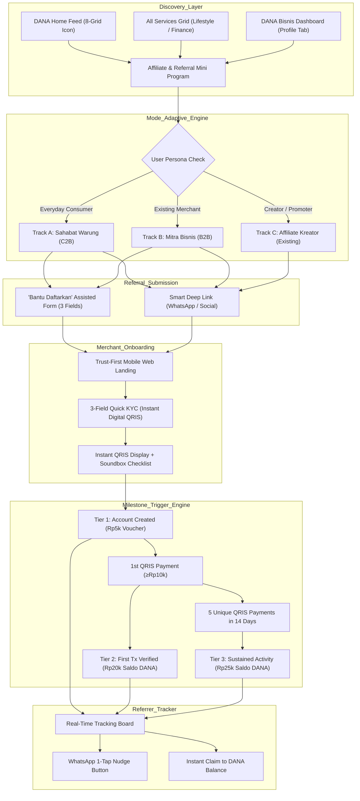
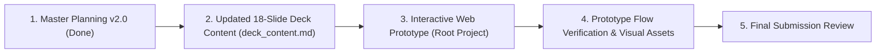

# DANA Bisnis Merchant Referral Program — Master Planning & Product Specification (v2.0)

> **Role & Submission Context**: DANA Take-Home Challenge — **Product Developer Intern**  
> **Topic**: Evolving the Existing "Affiliate DANA Bisnis" into an Adaptive Grassroots Referral Engine  
> **Target Reviewer**: Fritz Nathaniel (`fritz.nathaniel@dana.id`) & Product / Design Review Panel at DANA Indonesia  
> **Candidate**: Hafizh Najwan (`hafizhnjwn`)  
> **Date**: September 2026  
> **Deliverables**: 
> 1. Comprehensive Master Planning & Strategy Specification (`planning.md`)
> 2. 18-Slide Presentation Deck Blueprint in Polished English (`deck_content.md`)
> 3. Interactive Web-Based Clickable Prototype with Smartphone Simulator (Root project `index.html`)

---

## 1. Forensic Audit & Deep Research of Existing DANA Features

Based on a forensic audit of the 18 production screenshots from the current DANA iOS/Android app (`context/` directory) and official DANA documentation (`dana.id`), here is the comprehensive analysis of DANA's existing features, constraints, onboarding requirements, reward structures, and referencing mechanics:

### 1.1 Existing Feature Overview: "Affiliate DANA Bisnis" & "DANA Bisnis"
* **Discovery & Placement in DANA App**:
  - **Home Screen**: Directly accessible via the primary 8-icon shortcut grid as **"Affiliate DAN..."** (`IMG_8049.PNG`).
  - **"All Services" (Lihat Semua)**:
    - Categorized under **"Lifestyle & Deals"** as **"Affiliate DANA Bisnis"** with a dual-silhouette icon (`IMG_8055.PNG`). Located alongside companion merchant tools like *"Edit Foto Jualan"* (AI product photo enhancer).
    - Also discoverable under **"Finance"** as **"DANA Bisnis"** with a store awning and "Rp" emblem (`IMG_8054.PNG`).
  - **User Profile ("Saya")**: Features a top dual-toggle switch allowing users to switch between **"Personal"** and **"Bisnis"** modes (`IMG_8058.PNG`, `IMG_8068.PNG`).
* **Technical Runtime & Architecture**:
  - Built as a **DANA Mini Program** powered by the Ant Financial / Alipay Mini Program container (evidenced by the native title bar with `...` options and `(X)` close buttons, `IMG_8061.PNG`).
* **Navigation Architecture (4 Bottom Tabs)**:
  1. `Beranda` (Home Dashboard): Referral code box, 4-step commission guide, creator earning banners, affiliate guides, recent commissions, and milestone rewards (`IMG_8061.PNG`, `IMG_8062.PNG`).
  2. `Referal` (Referral List): Dedicated search bar and status tabs (`Semua` | `Belum Aktif`) with merchant list (`IMG_8063.PNG`).
  3. `Peringkat` (Leaderboard & Inspiration): Subtabs for `Papan Peringkat` (Top 20 affiliates ranked by 7/30 days) and `Inspirasi Konten` (video tutorials by top creators, `IMG_8064.PNG`, `IMG_8065.PNG`).
  4. `Inbox` (Notification Center): Broadcasts commission disbursement updates and system notices.

### 1.2 Existing Reward & Incentive Rules ("Ketentuan Komisi")
Audited directly from the production legal terms popup (`IMG_8066.PNG`):
* **Base Commission ("Komisi Utama")**: **Rp45.000** per active merchant.
* **Current Active Merchant Criteria ("Kriteria Usaha Aktif")**:
  - **Requirement 1**: Minimum of **5 QRIS transactions** completed.
  - **Requirement 2**: Passes transaction validity audit by the DANA Risk & Compliance Team.
  - **Operational Constraint**: **Verification takes 1 to 14 business days** (*"Pengecekan memerlukan waktu 1 hingga 14 hari"*).
* **Disbursement Timeline**: Commission is automatically credited into the referrer's DANA balance maximum **48 hours** after the active criteria is validated.
* **Commission Variation**: Commission per affiliate can vary based on the affiliate's transaction activity and the activity of the registered merchant.
* **Volume Milestone Bonus ("Hadiah Pencapaian")**:
  - Bonus **Rp1.000.000** for every **50 active merchants** using their QRIS (`IMG_8062.PNG`).
* **Target Audience Bias (Content Creator Orientation)**:
  - The existing UI heavily targets digital influencers and video creators. It showcases banners like *"Ada Affiliate yang sudah dapat Rp90 juta, lho!"* and displays a leaderboard where top affiliates (e.g. `MIC***`, `LIA***`, `FRI***`) have registered 800–900 active merchants earning Rp36M–Rp40M (`IMG_8064.PNG`).
  - It features an *"Inspirasi Konten"* tab with video guides by creators like `@andri.irv`, `@sudutbgrbarat`, and `@mitra.dana.bisnis` (`IMG_8065.PNG`).

### 1.3 Existing Merchant Registration & Onboarding ("Cara Daftar DANA Bisnis")
Audited from the in-app onboarding guide (`IMG_8068.PNG`, `IMG_8069.PNG`):
* **Strict Prerequisites & Steps**:
  - **Step 1**: Open the "Saya" (Profile) tab in DANA.
  - **Step 2**: **Mandatory DANA Premium Account**: User must be verified with an e-KTP photo and biometric facial recognition (`IMG_8068.PNG`).
  - **Step 3**: Toggle top switch from "Personal" to "Bisnis".
  - **Step 4**: Complete business profile:
    - *Profil Usaha*: Store name, business category.
    - *Lokasi Usaha*: Address details (RT/RW, subdistrict, store photo).
    - *Kode Referral*: **User must manually type in the affiliate's referral code**.
  - **Step 5**: Wait for backend verification: *"Memverifikasi datamu... Kami akan mengabarimu setelah prosesnya selesai. Ditunggu ya!"* (`IMG_8069.PNG`).
* **Merchant Value Proposition ("Kelebihan QRIS DANA Bisnis", `IMG_8067.PNG`)**:
  - *QRIS Bebas Potongan*: MDR 0% for micro-merchants (all sales revenue retained 100%).
  - *Saldo Langsung Cair*: Instant bank withdrawal with zero admin fees (no next-day T+1 delay).
  - *Suara di Tiap Transaksi*: Free audio announcement on every incoming payment (*"Nada DANA menyebutkan nominal tiap transaksi masuk"* / soundbox effect).
  - *Percantik Foto Produk*: AI-driven photo enhancer for menus, logos, and promotional posters.
  - *Rekan DANA*: Ability to become a neighborhood cash top-up agent.

---

## 2. Core Friction Points in Existing DANA & Strategic Breakthroughs (v2.0)

While the existing "Affiliate DANA Bisnis" is a strong program for online influencers, it faces severe structural barriers when applied to **organic, offline community referrals** (everyday consumers referring their neighborhood warung, or warung owners referring adjacent merchants):

| Operational Friction in Existing DANA | Root Cause in Production | Strategic Breakthrough in v2.0 |
| :--- | :--- | :--- |
| **1. The Cognitive Registration Wall** | Hesitant warung owners must upgrade to DANA Premium (KTP selfie), toggle to Bisnis, fill extensive forms, and **manually type the referral code**. | **"Bantu Daftarkan" (Assisted Pre-Registration)**: The referrer pre-fills Store Name, Category, & Owner Phone. Generates a tailored deep-link with the referral code hardcoded and locked. |
| **2. The 5-Transaction "Cliff" & 14-Day Black Hole** | Referrers get **Rp 0** unless the warung hits 5 txs AND waits 1–14 days for manual review. If a warung stops at 2 txs, the referrer gets zero, causing immense drop-off. | **Milestone-Based Tiered Payout**: Unlocks progressive gratification: **Tier 1 (Instant QRIS issuance)** = Rp5,000 voucher; **Tier 2 (1st tx ≥Rp10k)** = Rp20,000 cash; **Tier 3 (5 txs / 14 days)** = Rp25,000 retention bounty. Total: Rp50,000. |
| **3. Zero Reciprocal Benefit for the Merchant** | In the current program, only the affiliate gets cash (Rp45,000). The referred warung receives no dedicated referral welcome bonus, lowering their motivation to adopt. | **Dual-Sided Milestone Incentives**: Referred warung unlocks **Rp10,000** bill voucher upon KYC Light, **Rp15,000** Modal Usaha upon 1st QRIS transaction, and 30 days of 0% MDR extension upon Tier 3. |
| **4. Passive & Blind Tracking** | Current "Daftar Referral" screen only shows binary "Semua" vs "Belum Aktif", with zero progress indicators (e.g. 2/5 txs) and no ability to follow up. | **Actionable Tracker with Peer Nudging**: Visual progress stages (`Registered` → `1st Tx Pending` → `Active`) plus a 1-tap **"Ingatkan via WhatsApp"** button with pre-written, friendly reminder scripts. |
| **5. Influencer Bias vs Everyday Consumer Empathy** | UI emphasizes Rp90M earnings and TikTok content ideas, which alienates ordinary consumers who just want their favorite *soto* or *warteg* stall to accept QRIS. | **Dual-Mode Experience**: Retains the "Affiliate Kreator" tab for influencers, while introducing the "Ajak Warung Langganan" (Sahabat Warung) mode tailored for everyday community users. |

---

## 3. Product Architecture & 8 Core Wireframe Screens

### 3.1 The 8 Core Product Wireframe Screens
1. **Screen 1: DANA App Discovery (Home 8-Grid & All Services)**
   - Hero banner on DANA Home: *"Ajak Warung Langganan, Raih Saldo s/d Rp50.000"*.
   - Native branded icon in 8-grid and "All Services" under *Lifestyle & Deals*: *"Affiliate DANA Bisnis"*.
2. **Screen 2: Referral Mini Program Hub (Beranda)**
   - Performance Card: Total Saldo DANA earned, active referrals count, and ranking.
   - Referral Code Box (`HAF58W`) with 1-tap copy, QR preview, and direct WhatsApp share.
   - **Primary Action Card**: *"Bantu Daftarkan Warung Langganan"* (Assisted Nomination).
   - Bottom Sections: *Panduan Affiliate* (Kelebihan QRIS, Cara Daftar, FAQ) & *Hadiah Pencapaian* (Rp1.000.000 per 50 usaha aktif).
3. **Screen 3: "Bantu Daftarkan Warung" (Assisted Nomination Modal)**
   - Step 1: Input Nama Usaha (e.g. *Warung Nasi Bu Siti*).
   - Step 2: Pilih Kategori Usaha (F&B / Warung Makan, Toko Kelontong, Jasa / Bengkel, Fashion / Retail).
   - Step 3: Nomor WhatsApp Pemilik Usaha (+62 format auto-validation).
   - Action Button: *"Kirim Undangan Resmi DANA Bisnis"*.
4. **Screen 4: Referral Tracking Board (Daftar Referral v2.0)**
   - Filter Tabs: *Semua*, *Dalam Proses (Menunggu Transaksi)*, *Aktif (Siap Klaim)*, *Juara (Selesai)*.
   - Merchant Progress Cards showing 3 visual stages (`Pendaftaran`, `Transaksi Pertama`, `5x Transaksi`).
   - Actionable **"Ingatkan Pemilik Toko" (WhatsApp Nudge)** button with contextual pre-written templates.
5. **Screen 5: Reward Claim Center & Transaction Ledger**
   - Total claimable balance indicator.
   - Breakdown of pending vs claimable rewards by merchant name.
   - 1-Tap *"Klaim Saldo DANA"* button with instant balance credit, DANA chime sound, and haptic feedback.
6. **Screen 6: Referred Warung Landing Page (Mobile Web)**
   - Personalized greeting: *"Dimas Mengundang Warung Bu Siti Bergabung ke DANA Bisnis"*.
   - Reassurance points addressing merchant fears: **Rp0 Biaya Pendaftaran**, **Terima Semua Pembayaran (BCA, GoPay, OVO, Livin)**, **Saldo Langsung Cair**.
   - CTA: *"Daftar Gratis dalam 2 Menit"*.
7. **Screen 7: 3-Field Quick KYC Light Registration**
   - Pre-filled Store Name & Category from assisted submission.
   - GPS Auto-Location picker ("Gunakan Lokasi Toko Saat Ini").
   - Instant Terms & Conditions agreement checkbox.
   - Primary CTA: *"Terbitkan QRIS Saya Sekarang"*.
8. **Screen 8: Instant Digital QRIS & First-Day Starter Kit**
   - High-resolution National QRIS with merchant name (`WARUNG BU SITI - DANA BISNIS`).
   - Action buttons: *Unduh Poster Siap Cetak (PDF)*, *Simpan Gambar QR*.
   - Interactive 3-Step First-Day Checklist:
     - [x] QRIS Berhasil Diterbitkan.
     - [ ] Uji Coba Scan Rp1.000 (Dengar Nada DANA Transaksi Masuk).
     - [ ] Terima Pembayaran Pelanggan Pertama ≥Rp10.000 (Klaim Bonus Modal Rp15.000).

---

## 4. Incentive Economics & Unit Economics Model

### 4.1 Tiered Milestone Payout Structure
Grounded directly in DANA's existing **Rp45.000 base commission** and **5-transaction active criteria**, but restructured into progressive milestones to prevent abandonment:

| Stage | Trigger Event | Referrer Reward | Referred Merchant Reward | Anti-Fraud Verification Gate |
| :--- | :--- | :--- | :--- | :--- |
| **Tier 1: Onboarding** | KYC Light completed & Digital QRIS issued | **Rp 5.000** DANA Bill Voucher (Min. spend Rp25k) | **Rp 10.000** DANA Pulsa/Bill Voucher | Device fingerprint, unique SIM card check, max 3 nominations/day per referrer. |
| **Tier 2: 1st Activation** | 1st QRIS payment (≥Rp10,000) processed | **Rp 20.000** Saldo DANA (Instant Cash Credit) | **Rp 15.000** Saldo Modal Usaha (Direct Credit) | Payer wallet age >14 days; Payer and Merchant cannot share device ID, IP subnet, or NIK. |
| **Tier 3: Retention** | 5 unique QRIS transactions across ≥3 days | **Rp 25.000** Saldo DANA (Bonus Bounty) | 30 Days 0% MDR Extension + "DANA Juara" Badge | 5 distinct customer accounts; velocity check prevents rapid-fire sequential payments. |
| **Total Value** | Complete 14-day retained merchant | **Rp 50.000** (Cash + Vouchers) | **Rp 25.000** Cash + Vouchers | **Blended Fraud Exposure: < 2.5%** |

### 4.2 Unit Economics: Blended CAC vs 1-Year Merchant LTV
* **Weighted Blended CAC per Transacting Merchant**:
  - Referrer Payout (factoring milestone drop-off): **Rp 24,000**
  - Merchant Starter Pack & Vouchers: **Rp 10,500**
  - **Total Blended CAC**: **Rp 34,500** (vs. Rp 75,000 - Rp 120,000 for direct offline sales agents).
* **Expected 1-Year Merchant LTV**:
  - Annual QRIS Volume: ~Rp 15,000,000 @ 0.7% MDR = **Rp 105,000** net fee revenue.
  - Ecosystem Spillover (Warung customers retaining balances and paying bills on DANA): **Rp 195,000**.
  - **Total 1-Year LTV**: **Rp 300,000**.
  - **LTV / CAC Ratio**: **8.7x** with a payback period of **~2.9 months**.

---

## 5. Technical Implementation Architecture

* **Client Runtime**: Ant Financial Mini Program framework (`@alipay/miniprogram-core` DSL) inside DANA iOS/Android host app.
* **API Gateway & Routing**: Kong Gateway handling rate-limiting, JWT authentication, and device integrity checks.
* **Asynchronous Event-Driven Broker**: Apache Kafka topics (`dana.tx.qris.completed`, `dana.referral.assisted_submit`, `dana.referral.milestone_unlocked`).
* **Anti-Fraud Engine**: Automated risk evaluation checking:
  - Device Fingerprinting (IMEI / MAC hash / Android ID).
  - Geolocation proximity between customer scan and registered store coordinates.
  - Social Graph Analysis (flags closed loops where User A pays Merchant B and Merchant B pays User A).
* **Core Ledger Integration**: Direct atomic transactions via DANA Core Wallet Service with ACID compliance.

---

## 6. Execution Roadmap & Deliverables Tracker

1. **Step 1 (Completed)**: Comprehensive planning updated with deep audit of production screenshots, existing constraints, and strategic breakthroughs.
2. **Step 2 (In Progress)**: Update `deck_content.md` with complete 18 slides in polished English, mapping existing DANA features, screenshots, and the "Bantu Daftarkan" breakthrough.
3. **Step 3 (Completed — aligned to v2.0)**: Built the interactive web prototype in `/Users/hafizhnjwn/Lamaran/DANA` (React + Vite + Tailwind) matching DANA's real UI elements (#108EE9, Mini Program title bar with `···`/`✕`, the 4 production bottom tabs `Beranda`/`Referal`/`Peringkat`/`Inbox`, referral code box, Hadiah Pencapaian, Nada DANA soundbox simulation via Web Audio). 12 clickable screens covering the 8 core wireframes plus both production discovery entry points, 3 switchable role lenses (Sahabat Warung / Mitra Bisnis / warung yang diundang), a retained `Affiliate Kreator` mode for comparison, and a backend event simulator. Run with `npm install && npm run dev`; see `README.md` for the demo script and the kept-vs-new matrix.
4. **Step 4**: Test interactive flows end-to-end and document prototype links.
5. **Step 5**: Prepare final submission package for Fritz Nathaniel & DANA Indonesia.
